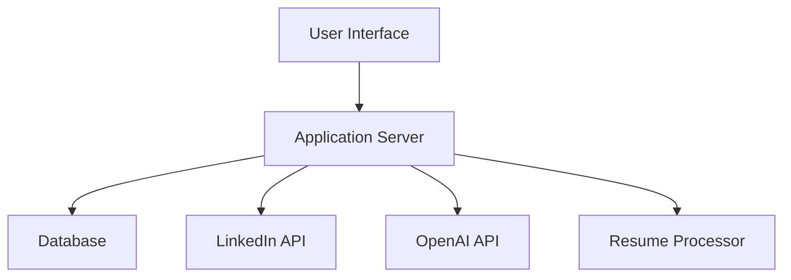

# Project Plan

## Table of Contents

1. [Introduction](#introduction)
2. [Features](#features)
3. [Technical Implementation](#technical-implementation)
4. [User Flow](#user-flow)
5. [Security](#security)
6. [Error Handling](#error-handling)
7. [Future Enhancements](#future-enhancements)
8. [Documentation](#documentation)
9. [Technical Details](#technical-details)

## Introduction

This project aims to create an automated job application system that:

- Supports multiple users
- Provides web and mobile interfaces
- Automates LinkedIn job applications
- Uses AI for resume optimization and personalized messaging

## Features

- Multi-user support
- Cross-platform compatibility (web and mobile)
- PDF resume upload and optimization
- LinkedIn automation:
  - Login and job search
  - Application submission
  - Notification system
- AI-powered resume customization
- Email notifications

## Technical Implementation

### Architecture



### Database Requirements

- PostgreSQL for multi-user support
- Tables:
  - Users (id, email, password_hash, created_at)
  - Resumes (id, user_id, file_path, processed_data)
  - Applications (id, user_id, job_id, status, timestamp)

### API Management

- Rate limiting: 10 requests/second
- Error handling with exponential backoff
- Circuit breaker pattern for API failures

### Logging & Monitoring

- Centralized logging with ELK stack
- Application performance monitoring with Prometheus
- Error tracking with Sentry

### Deployment Strategy

- Docker containers for all services
- Kubernetes orchestration
- Cloud hosting on AWS/GCP
- CI/CD pipeline with GitHub Actions

## User Flow

### User Stories

1. As a job seeker, I want to upload my resume so that the system can optimize it for applications
2. As a user, I want to receive notifications about my applications so I can track my progress
3. As a user, I want to see statistics about my applications so I can measure my success rate

### Interface Wireframes

[Add link to Figma wireframes]

### Onboarding Process

1. Account creation
2. Resume upload
3. Job preferences setup
4. LinkedIn credentials setup
5. Notification preferences

### Notification Settings

- Email notifications for:
  - New applications
  - Application status updates
  - Weekly summary
- In-app notifications
- SMS notifications (optional)

## Security

### Authentication

- OAuth2 with JWT tokens
- Password hashing with bcrypt
- Two-factor authentication

### Data Protection

- AES-256 encryption for sensitive data
- SSL/TLS for all communications
- Regular security audits

### Compliance

- GDPR compliance for EU users
- CCPA compliance for California users
- Data retention policies

### Session Management

- 30-minute session timeout
- Automatic logout on inactivity
- Concurrent session control

## Error Handling

### Recovery Strategies

- Automatic retry for failed API calls
- Queue system for pending applications
- Fallback to manual application process

### User Notifications

- Real-time error reporting
- Suggested actions for common errors
- Support contact for unresolved issues

### LinkedIn Interactions

- Rate limit detection and handling
- Captcha solving mechanism
- Session management for LinkedIn

### Fallback Strategies

- Local caching of job listings
- Offline mode for application tracking
- Manual override option

## Future Enhancements

- Support for other platforms (Indeed, Glassdoor)
- AI-based resume optimization
- Interview scheduling integration
- Performance analytics dashboard
- Skill gap analysis
- Job market trends visualization

## Documentation

### API Documentation

- Swagger/OpenAPI specification
- Postman collection
- Example requests/responses

### Developer Setup

- Local development environment setup
- Testing instructions
- Contribution guidelines
- Code style standards

### Testing Strategy

- Unit tests for core functionality
- Integration tests for API interactions
- End-to-end tests for user flows
- Load testing for scalability

### Contribution Guidelines

- Branch naming conventions
- Pull request process
- Code review standards
- Issue tracking workflow

## Technical Details

### System Requirements

- Minimum:
  - 2 CPU cores
  - 4GB RAM
  - 10GB storage
- Recommended:
  - 4 CPU cores
  - 8GB RAM
  - 20GB storage

### Browser Compatibility

- Chrome (latest 2 versions)
- Firefox (latest 2 versions)
- Safari (latest 2 versions)
- Edge (latest 2 versions)

### Mobile Framework

- React Native for cross-platform mobile development
- Progressive Web App for web interface

### CI/CD Pipeline

- Automated testing on pull requests
- Staging environment for QA
- Blue-green deployment strategy
- Rollback mechanism

## Packages Used

- `python-dotenv`
- `openai`
- `selenium`
- `robotframework`
- `robotframework-seleniumlibrary`
- `robotframework-pythonlibcore`

## About RPA

Tutorial video about how to learn [RPA](https://www.youtube.com/watch?v=65OPFmEgCbM&list=PLx4LEkEdFArgrdD_lvXe_hYBy8zM0Sp3b&index=1)

Plugin: Intellibot@Selenium Library

------------------Simple tutorial videos below---------------------

[Bilibili link](https://www.bilibili.com/video/BV1UC4y1N78v/?share_source=copy_web&vd_source=b2608434484091fcc64d4eb85233122d)

[YouTube link](https://youtu.be/TlnytEi2lD8?si=jfcDj2MZqBptziZc)

## How to Run

First clone the project locally, then execute in the project root directory

```bash
pip install -r requirements.txt
```

### Assistant Mode

Open the .env file and configure your OpenAI API key
Then upload your PDF resume to the auto_job_find folder, named "my_cover". Then execute write_response.py
This mode does not support custom APIs, but has faster execution speed
If you need to use a custom API, please use the following method

### Langchain Mode

Similarly, open the .env file and configure your OpenAI API key and the API address you want to request
Then put your PDF resume in the resume folder
Finally execute write_response.py

### ChatGPT4 and above running method

If trying to use newer chatGPT, cannot keep the latest version as `v1.1.1`. If the error message is `An error occurred: Error code: 400 - {'error': {'message': "The requested model 'gpt-4o-mini' cannot be used with the Assistants API in v1. Follow the migration guide to upgrade to v2: https://platform.openai.com/docs/assistants/migration.", 'type': 'invalid_request_error', 'param': 'model', 'code': 'unsupported_model'}}`

1. Need to manually update chatgpt to the latest version,

```shell
pip install --upgrade openai
```

2.And change the structure in `create_assistant`, refer to [Migration Guide](https://platform.openai.com/docs/assistants/migration) for details. It's recommended to manually add the latest assistant on the [platform](https://platform.openai.com/assistants/) and copy the code to `assistant.json` for convenience.

```json
{ "assistant_id": "asst_token" }
```
