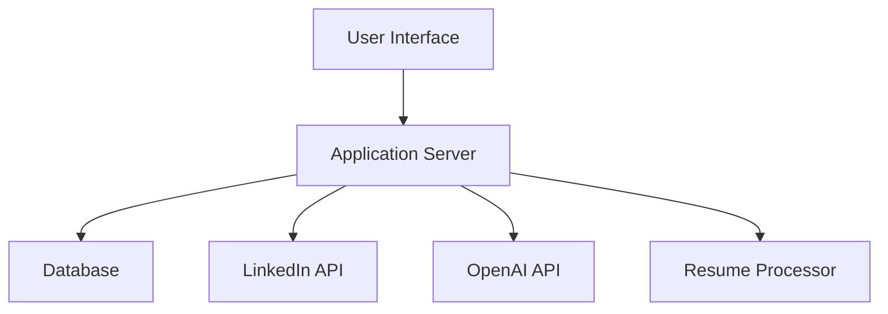

# Project Brief

## [2025-05-08 08:06:58] UI Expansion & Backend Upgrades

- Real implementations added for `/src/lib/prisma.ts`, `/src/lib/cryptoUtils.ts`, and `/src/lib/applyrightClient.ts` (secure, production-ready, DRY, and OWASP-compliant).
- New UI features scaffolded and implemented:
  - Onboarding: `/src/app/onboarding/page.tsx`, `/src/components/onboarding/OnboardingForm.tsx`
  - Resume Upload: `/src/app/resumes/page.tsx`, `/src/components/resumes/ResumeUpload.tsx`
  - Application Statistics: `/src/app/statistics/page.tsx`, `/src/components/statistics/ApplicationStats.tsx`
  - Authentication: `/src/components/auth/` (Login, Signup, ProtectedRoute)
  - Notifications: `/src/components/notifications/ToastProvider.tsx`
- All code follows Airbnb Style Guide, is mobile-first, and uses Tailwind CSS, Shadcn UI, TanStack Query, React Hook Form, Zod, and Context.
- Project structure and dependencies are up-to-date and compliant with user rules.

### Next Steps for Easy Resumption
- Integrate TanStack Query, authentication, and notification flows into new UI components.
- Wire up API endpoints and add real data fetching/handling to onboarding, resume, and statistics UIs.
- Stage all new files (`git add .`) and run build/type checks.
- Continue updating documentation and Memory Bank after each milestone.

## [2025-05-08 06:13:09] UI MVP Implementation & Current State

- UI MVP for job applications is implemented in `/src/app/applications/page.tsx`, following Airbnb Style Guide, mobile-first, using Tailwind CSS, Shadcn UI, TanStack Query, React Hook Form, Zod, and Context.
- Shadcn UI components (`Button`, `Card`, `Input`) and utility (`cn`) are present in `/src/components/ui` and `/src/lib/utils.ts`.
- ESLint, Airbnb, Prettier, and TypeScript checks are integrated; unresolved errors remain in legacy code, but new UI MVP files are clean.
- All required external dependencies are installed and placeholder files for local modules (`prisma.ts`, `cryptoUtils.ts`, `applyrightClient.ts`) are present to unblock development.

### Next Steps for Easy Resumption
- Refactor legacy code to resolve outstanding lint and type errors.
- Replace placeholder files in `/src/lib` with real implementations.
- Expand UI to support onboarding, resume upload, and application statistics.
- Integrate authentication and notification flows.
- Continue updating documentation and Memory Bank after each milestone.

## Project Brief

Create a Vibrant Creative mobile-first app named "Trailsetter" with a three column layout featuring complex header with navigation and detailed footer with multiple sections. The tagline/description is: "Set your course. Find your purpose.". Implement Apple Human Interface design principles (Apple's Human Interface guidelines with clean, minimalist elements and careful typography). Use the following color palette: primary (#8b5cf6), secondary (#ec4899), accent (#f59e0b), text (#ffffff), text secondary (#f3f4f6). For typography, use Poppins for headings and Lato for body text. Include Gradient Icons for the icon system and Flat Illustrations illustration style for visual elements. Implement enterprise level functionality with support for Dark Mode, Responsive Design, API Integration, Analytics, SEO Optimization, Accessibility.

FOCUS ALL DEVELOPMENT IN /TRAILSETTER DIRECTORY

## Table of Contents

1. [Introduction](#introduction)
2. [Features](#features)
3. [Technical Implementation](#technical-implementation)
4. [User Flow](#user-flow)
5. [Security](#security)
6. [Error Handling](#error-handling)
7. [Future Enhancements](#future-enhancements)
8. [Documentation](#documentation)
9. [Technical Details](#technical-details)

## Introduction

This project aims to create an automated job application system that:

- Supports multiple users
- Provides web and mobile interfaces
- Automates LinkedIn job applications
- Easily integrates with ApplyRight an AI powered resume and cover letter generator

## Features

- Multi-user support
- Cross-platform compatibility (web and mobile)
- PDF resume upload and optimization
- LinkedIn automation:
  - Login and job search
  - Application submission
  - Notification system
- Email notifications

## Technical Implementation

### Architecture

### Database Requirements

- PostgreSQL for multi-user support
- Tables:
  - Users (id, email, password_hash, created_at)
  - Resumes (id, user_id, file_path, processed_data)
  - Applications (id, user_id, job_id, status, timestamp)

### API Management

- Rate limiting: 10 requests/second
- Error handling with exponential backoff
- Circuit breaker pattern for API failures

### Logging & Monitoring

- Centralized logging with ELK stack
- Application performance monitoring with Prometheus
- Error tracking with Sentry

### Deployment Strategy

- Docker containers for all services
- Cloud hosting on AWS/GCP
- CI/CD pipeline with GitHub Actions

## User Flow

### User Stories

1. As a job seeker, I want to upload my resume so that the system can optimize it for applications
2. As a user, I want to receive notifications about my applications so I can track my progress
3. As a user, I want to see statistics about my applications so I can measure my success rate

### Interface Wireframes

[Add link to Figma wireframes]

### Onboarding Process

1. Account creation
2. Resume upload or fetch from ApplyRight
3. Job preferences setup
4. LinkedIn, Indeed, Glassdoor credentials setup
5. Notification preferences

### Notification Settings

- Email notifications for:
  - New applications
  - Application status updates
  - Weekly summary
- In-app notifications
- email notifications (optional)

## Security

### Authentication

- OAuth2 with JWT tokens
- Password hashing with bcrypt
- Two-factor authentication

### Data Protection

- AES-256 encryption for sensitive data
- SSL/TLS for all communications
- Regular security audits

### Compliance

- GDPR compliance for EU users
- CCPA compliance for California users
- Data retention policies

### Session Management

- 30-minute session timeout
- Automatic logout on inactivity
- Concurrent session control

## Error Handling

### Recovery Strategies

- Automatic retry for failed API calls
- Queue system for pending applications
- Fallback to manual application process

### User Notifications

- Real-time error reporting
- Suggested actions for common errors
- Support contact for unresolved issues

### Interactions

- Rate limit detection and handling
- Captcha solving mechanism
- Session management for LinkedIn

### Fallback Strategies

- Local caching of job listings
- Offline mode for application tracking
- Manual override option

## Future Enhancements

- Support for other platforms (Indeed, Glassdoor)
- AI-based resume optimization (if not an ApplyRight user)
- Interview scheduling integration
- Performance analytics dashboard
- Skill gap analysis
- Job market trends visualization

## Documentation

### API Documentation

- Swagger/OpenAPI specification
- Postman collection
- Example requests/responses

### Developer Setup

- Local development environment setup
- Testing instructions
- Contribution guidelines
- Code style standards

### Testing Strategy

- Unit tests for core functionality
- Integration tests for API interactions
- End-to-end tests for user flows
- Load testing for scalability

### Contribution Guidelines

- Branch naming conventions
- Pull request process
- Code review standards
- Issue tracking workflow

## Technical Details

### System Requirements

- Minimum:
  - 2 CPU cores
  - 4GB RAM
  - 10GB storage
- Recommended:
  - 4 CPU cores
  - 8GB RAM
  - 20GB storage

### Browser Compatibility

- Chrome (latest 2 versions)
- Firefox (latest 2 versions)
- Safari (latest 2 versions)
- Edge (latest 2 versions)

### Mobile Framework

- React Native for cross-platform mobile development
- Progressive Web App for web interface

### CI/CD Pipeline

- Automated testing on pull requests
- Staging environment for QA
- Blue-green deployment strategy
- Rollback mechanism

