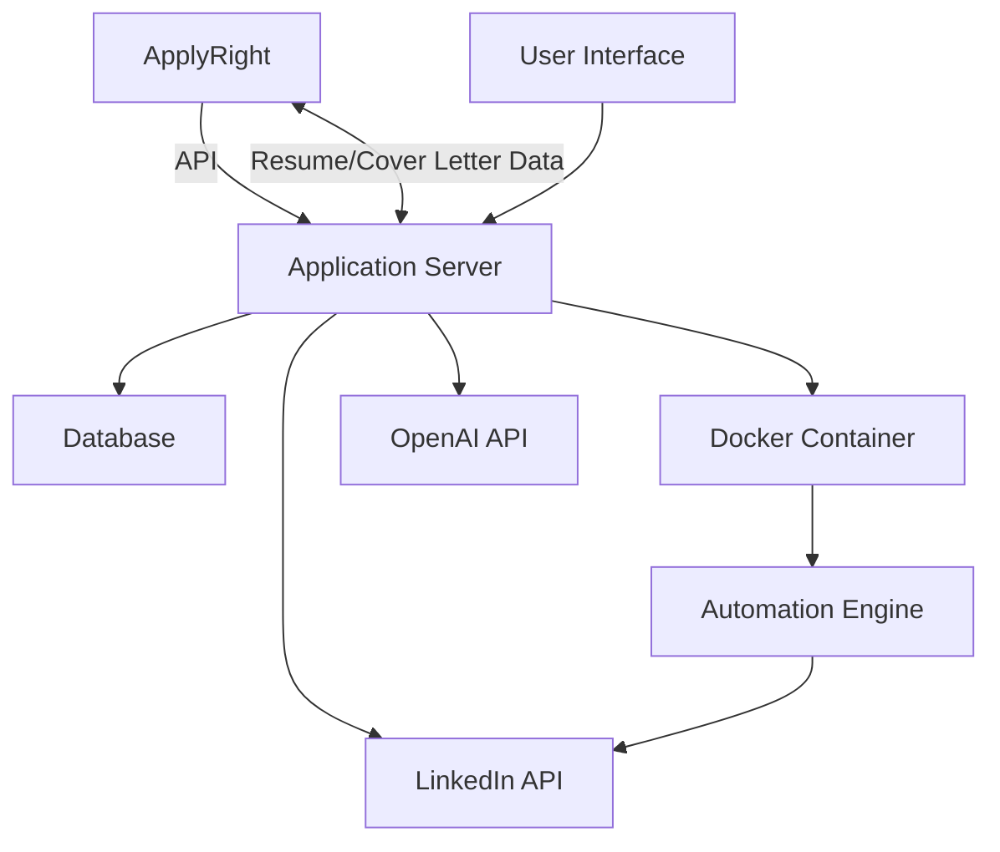
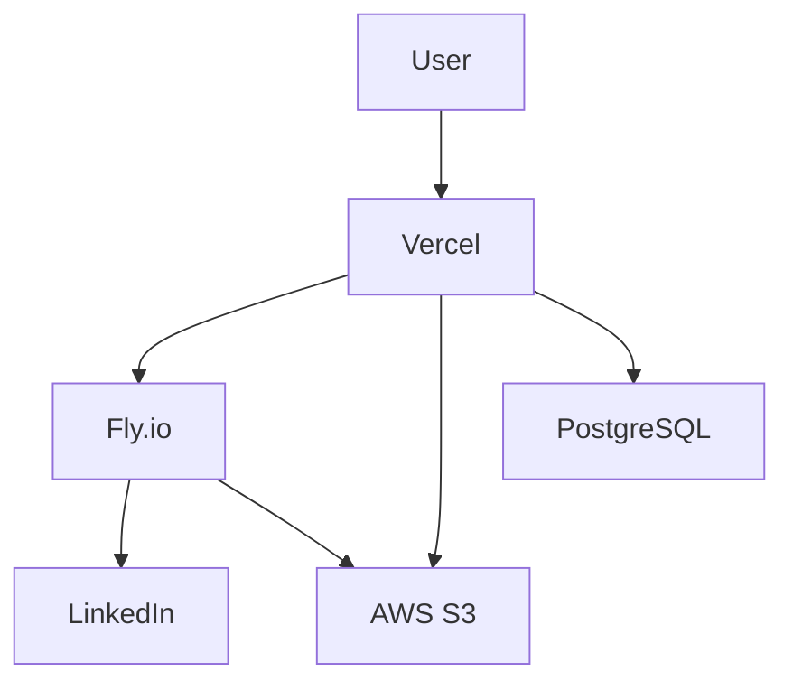
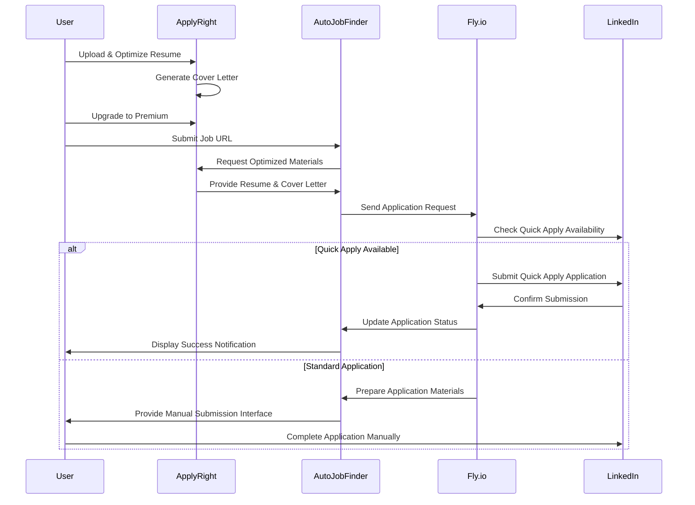

# System Patterns - 2023-03-17

## System Architecture

The Auto Job Finder follows a modern microservices architecture with integration to the existing ApplyRight platform:

### Key Components

1. **User Interface Layer**: React (Web) and React Native (Mobile) within existing ApplyRight platform
2. **Application Server**: Next.js backend with serverless functions on Vercel
3. **Database**: PostgreSQL with defined schema
4. **External APIs**: LinkedIn API, OpenAI API
5. **ApplyRight Integration**: API endpoints for data exchange
6. **Automation Engine**: Python-based Docker container on Fly.io
7. **Document Storage**: AWS S3 for resume and cover letter storage

## Deployment Architecture

### Key Services

1. **Vercel**: Hosts Next.js frontend and API routes
2. **Fly.io**: Hosts containerized Python automation engine (free tier)
3. **AWS S3**: Stores documents (resumes, cover letters)
4. **PostgreSQL**: Stores user data and application tracking

## Design Patterns

### Adapter Pattern

- Used to integrate with ApplyRight's existing API
- Normalizes data formats between systems
- Handles version compatibility

### MVC Architecture

- **Models**: Database schema and data access
- **Views**: React/React Native UI components
- **Controllers**: Express route handlers

### Repository Pattern

- Abstract data access layer
- Consistent interface for data operations
- Separation of business logic from data access

### Factory Pattern

- Used for creating different types of job applications
- Allows for platform-specific implementation details
- Facilitates adding new job platforms in the future

### Observer Pattern

- Used for notification system
- Allows components to subscribe to application status updates
- Ensures loose coupling between components

### Circuit Breaker Pattern

- Implemented for API interactions
- Prevents cascading failures
- Handles API rate limiting and failures gracefully

### Facade Pattern

- Provides a unified interface to ApplyRight subsystems
- Simplifies client interaction with the complex system
- Abstracts implementation details of integration

### Strategy Pattern

- Different application strategies for different job types
- Quick Apply vs. Standard Application processes
- Allows for adding new application strategies without modifying core code

## Component Relationships

### ApplyRight Integration

- Shared authentication system
- API-based data exchange for resumes and cover letters
- Webhooks for status updates
- Event-driven communication for real-time updates

### User Management

- Authentication using shared identity provider
- Role-based access control with premium user designation
- User preferences storage and retrieval

### Job Discovery

- Platform-specific job search implementations
- Common interface for job data
- Filter and recommendation engine based on ApplyRight resume data

### Application Processing

- Leveraging ApplyRight's resume and cover letter data
- Application submission automation
- Status tracking and reporting back to ApplyRight

### Notification System

- Email notification service
- In-app notification center
- Status tracking and updates
- Cross-platform notification delivery

## Data Flow - Job Application Process

## Technical Decisions

### Integration Architecture

- **API Gateway**: Single entry point for ApplyRight to Auto Job Finder communication
- **Message Queue**: Asynchronous processing of resume optimization requests
- **Shared Authentication**: JWT-based shared authentication system
- **Webhook System**: Real-time updates between systems

### Docker Container

- **Base Image**: Python 3.9 slim
- **Dependencies**: Selenium, FastAPI, OpenAI, boto3
- **External Storage**: Volume mounts for persistent data
- **Deployment**: Fly.io free tier (3 shared-CPU VMs with 256MB RAM)

### Database Schema

- **Users Table**: id, email, password_hash, created_at, subscription_level, applyright_user_id
- **Resumes Table**: id, user_id, file_path, processed_data, applyright_resume_id
- **Applications Table**: id, user_id, job_id, status, timestamp, cover_letter_id, resume_id
- **Jobs Table**: id, title, company, url, platform, has_quick_apply, created_at

### API Handling

- Rate limiting implementation using token bucket algorithm
- Retry mechanism with exponential backoff
- Fail-fast circuit breaker for unavailable services

### Security Approach

- AES-256 encryption for sensitive data
- HTTPS/TLS for all communications
- JWT token management with proper expiration
- Secure API key exchange between ApplyRight and Auto Job Finder

### Scalability Considerations

- Horizontal scaling for application servers
- Connection pooling for database access
- Caching layer for frequently accessed data
- Independent scaling of ApplyRight and Auto Job Finder services
